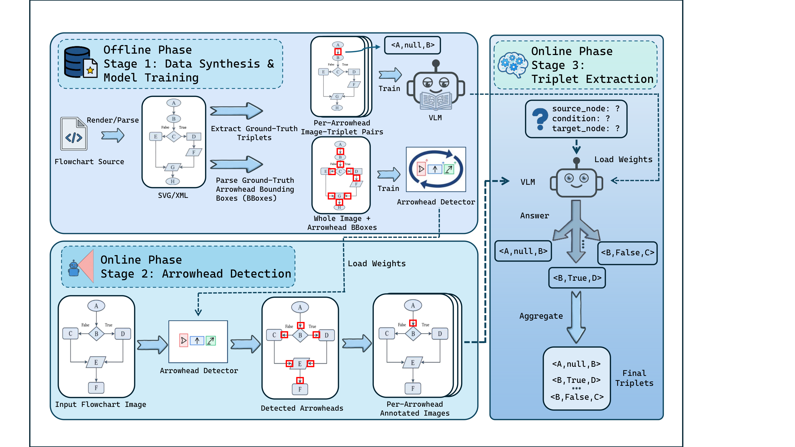

# TRACE

**Triplet Recovery via Arrowhead-Centric Extraction for Flowchart Understanding**

Daozhu Dong, Kaiwen Shi, Dan Si, Xiaoyu Hao, Tong Liu, Wenjie Zhang, Gong Cheng  
Nanjing University · Lenovo (Beijing) Co., Ltd.

[论文 / Paper](docs/files/trace-paper.pdf) · [海报 / Poster](docs/files/trace-poster.pdf) · [双语网页 / Website](docs/index.html) · [复现细节 / Reproduction](docs/REPRODUCING.md)

TRACE 以箭头头部为视觉锚点，在保留完整流程图上下文的情况下逐条提取 `(source, condition, target)` 三元组，再汇聚成可追溯的有向图。研究覆盖 9 个评测基准和 5 个 VLM 骨干，包含训练、推理、评测与下游图问答。

TRACE highlights one arrowhead per copy of the **full image**, asks a fine-tuned VLM to recover that edge, and aggregates triplets into a directed graph. Each output is traceable to an arrowhead. Multi-arrowhead batching (`K=2/3`) is included.



## Results

Qwen3-VL-4B, task-specific fine-tuning, exact F1 (%), paper Table 2:

| Benchmark | End-to-end | TRACE |
|---|---:|---:|
| FC_B | 80.42 | 84.32 |
| FlowLearn | 88.50 | 93.61 |
| BPMN-VLM | 64.26 | 87.07 |
| FlowGen-hard | 68.91 | 74.82 |

Downstream QA reaches 98.17% on FlowLearn and 75.78% on FlowVQA on TextFlow's released subset (paper Table 4). `K=3` reduces macro-average latency from 4.00 to 2.44 seconds/image, with F1 changing from 83.30 to 82.81 (paper Table 10). These are reported paper results, not reruns of this release.

## Contents

```text
gen_data/       Source parsers, training-format conversion, K-arrow synthesis
detection/      Detector COCO generation and YOLO conversion
sam3/           SAM 3 implementation and arrowhead-training configuration
MLLMs_SFT/      Qwen, Gemma, LLaVA, MiniCPM LoRA training and grid launchers
lora/inference/ TRACE, E2E, multi-arrowhead, and API inference
lora/eval/      Dataset-specific exact and relaxed F1 evaluation
postprocess/    Optional OCR vocabulary correction
QA/            Graph-query tools and downstream QA
assets/        SAM 3 tokenizer vocabulary required for local inference
scripts/       Detector training and local path configuration
tests/         Evaluation and data-path regression checks
docs/          Bilingual website, paper, poster, result table
```

Large datasets, weights, outputs, logs, and local settings are excluded from git. The older geometric node-segmentation pipeline in the development workspace is not the TRACE paper method and is not part of this release.

## Install and configure

Reference paper environment: Python 3.12, PyTorch 2.8.0 / CUDA 12.8, Transformers 4.57.1, PEFT 0.15.2. Choose a CUDA-compatible PyTorch build for your hardware.

```bash
conda create -n trace python=3.12 -y
conda activate trace
pip install -r requirements.txt
# Detector/VLM training:
pip install -r requirements-training.txt
# Install relevant Swift / OCR / rendering packages only when needed:
# pip install -r requirements-optional.txt

python scripts/configure_paths.py \
  --model-root /absolute/path/to/models \
  --data-root /absolute/path/to/TRACE/Dataset \
  --conda-root /absolute/path/to/miniconda3 --conda-env trace
```

The configuration command resolves legacy placeholders and retains ignored templates for reconfiguration. `--check` validates without writing. Configured paths must not contain spaces or shell metacharacters. The output root defaults to this checkout.

Download base models from their publishers (for example `models/Qwen3-VL-4B-Instruct` and `models/sam3/sam3.pt`); SAM 3 may require approved Hugging Face access. Fine-tuned TRACE adapters and detector checkpoints are **not bundled**; train them using the included launchers.

## Data preparation

Synthesized data record: [Zenodo DOI 10.5281/zenodo.20374997](https://doi.org/10.5281/zenodo.20374997). **Files currently have restricted access.** Request access through the record. This release does not publish the anonymous review token or change data permissions. The code can also synthesize supervision from original sources.

Separate supplementary archives contain `Dataset/data_4_training/`, `Dataset/bpmn/`, and `detection/datasets/`. Raw benchmarks come from their official sources listed in the reproduction guide. Derived data retain upstream restrictions; see [third-party notices](THIRD_PARTY_NOTICES.md).

Build the exact arrow manifest filenames expected by the grid launchers:

```bash
python -m gen_data.prepare_training_data \
  --data-dir Dataset/data_4_training \
  --datasets cbd fca fcb flowlearn flowvqa bpmn flowgen_easy flowgen_medium flowgen_hard
```

This includes official CBD/FC_B validation and BPMN `dev` manifests, and resolves relative annotated-image paths in the released data. TRACE training uses self-contained annotated images; E2E training and test inference require original images. For example, build FC_B E2E train and validation manifests:

```bash
python gen_data/format_data.py --dataset fcb --format triplet \
  --data-dir Dataset/data_4_training/fcb \
  --image-dir /absolute/path/to/FC_B/train \
  --output-dir Dataset/data_4_triplet_training
python gen_data/format_data.py --dataset fcb --format triplet \
  --data-dir Dataset/data_4_training/fcb_val \
  --image-dir /absolute/path/to/FC_B/val --output-prefix fcb_val \
  --output-dir Dataset/data_4_triplet_training
```

Match output names to each launcher's configuration; BPMN E2E validation uses `bpmn_triplet_dev.json`, configurable via `--triplet-output`. Checkpoint selection uses official validation or a fixed-seed partition of the training data.

## Train

```bash
# From the repository root:
bash scripts/train_sam3.sh --gpu-ids "0,1,2,3" --datasets "fcb flowlearn flowvqa"
bash scripts/train_yolo.sh --gpu-ids "0,1,2,3" --datasets "bpmn flowgen_easy"

# VLM launchers must run from the backbone directory:
cd MLLMs_SFT/Qwen-VL-Series-Finetune
bash scripts/train_all_TRACE_grid_search.sh --arrow-sources "sam3_ft groundtruth"
# Prepare original-image manifests before E2E training:
bash scripts/train_all_E2E_grid_search.sh
bash scripts/train_leave_one_out_TRACE.sh
```

Gemma, LLaVA, and MiniCPM have corresponding launchers in their backbone directories. These launchers train, select the best validation checkpoint, infer, and score. [The reproduction guide](docs/REPRODUCING.md) documents dataset-specific settings.

## Infer and evaluate

Run inference modules from the repository root:

```bash
python -m lora.inference.get_triplets_sft_trace \
  --image-dir /absolute/path/to/test_images --output-dir output/trace \
  --base-model-path /absolute/path/to/Qwen3-VL-4B-Instruct \
  --adapter-path /absolute/path/to/adapter_checkpoint \
  --arrow-source sam3_ft \
  --sam3-ft-checkpoint /absolute/path/to/detector_checkpoint.pt --gpus 0

# Reuse the K=1 detected boxes for multi-arrowhead batching:
python -m lora.inference.get_triplets_k \
  --image-dir /absolute/path/to/test_images --bbox-source-dir output/trace \
  --output-dir output/trace_k3 \
  --base-model-path /absolute/path/to/Qwen3-VL-4B-Instruct \
  --adapter-path /absolute/path/to/adapter_checkpoint \
  --k 3 --gpus 0 --timing-output output/trace_k3/timing.json

python -m lora.eval.eval_TRACE --dataset fcb --output-dir output/trace \
  --image-dir /absolute/path/to/test_images
python -m lora.eval.eval_E2E --dataset fcb --prediction-file output/e2e.json \
  --image-dir /absolute/path/to/test_images
python -m unittest discover -s tests -v
```

Use `--is-bpmn` / `--is-flowgen` for hierarchical outputs. `groundtruth` arrowheads are an oracle-box experiment, not deployable detection. Outputs are `output/<run>/<image_stem>/arrow_triplets.json`.

The K=1 adapter supports the paper's batching comparison; K-aware adapters are also supported. `gen_data/gen_k_arrow_data.py` retains the experimental split/manifest conventions for K-aware training: inspect its configuration and prepare the matching inputs first. Timing excludes model loading and reports throughput and average worker time; compare the same timing metric across runs.

Evaluators report exact F1 and relaxed F1 (component edit similarity ≥ 0.85). This release fixes missing prediction files being silently skipped, includes the 0.85 boundary, and makes matching traversal deterministic. Use `--image-dir` or `--test-json` to explicitly define the test split when ground-truth storage also contains training images. The launchers pass their test scope automatically. For sampled evaluation, supply a matching `--test-json` rather than relying on available predictions. These corrections can change scores for incomplete or boundary-case outputs; displayed paper tables are unchanged.

Graph QA uses the modules in `QA/`. Supply question/test-image/graph inputs through their CLI. Comparison launchers additionally expect TextFlow's released subset and prepared triplets; those dataset-derived files remain in the local research directory and are excluded from the code-only release. API inference/judging requires your own environment keys (`OPENAI_API_KEY`, `ZAI_API_KEY` as applicable).

## Bilingual project page

`docs/index.html` is a static page with local assets. **Chinese is the default**; the header switches languages, and `?lang=en` opens English directly. It includes the method diagram, a predefined arrow-query illustration, five-backbone results, QA, batching, PDFs, and citation copying. It does not call a live model. The poster QR code stays pointed at https://github.com/nju-websoft/TRACE.

```bash
python -m http.server 8000 --directory docs
```

Open `http://localhost:8000`. After pushing, GitHub Pages can serve `main` → `/docs` through **Settings → Pages → Deploy from a branch**. The proposed address is `https://nju-websoft.github.io/TRACE/`; use it in a CV only after deployment succeeds. Append `?lang=en` for English.

## License and citation

TRACE-authored code: [Apache-2.0](LICENSE). Third-party code, models, and data retain their terms; see [THIRD_PARTY_NOTICES.md](THIRD_PARTY_NOTICES.md).

```bibtex
@misc{dong2026trace,
  title = {TRACE: Triplet Recovery via Arrowhead-Centric Extraction for Flowchart Understanding},
  author = {Dong, Daozhu and Shi, Kaiwen and Si, Dan and Hao, Xiaoyu and Liu, Tong and Zhang, Wenjie and Cheng, Gong},
  year = {2026},
  url = {https://github.com/nju-websoft/TRACE}
}
```

This is a repository citation; replace it with the archival paper entry when available. Correspondence: gcheng@nju.edu.cn.
