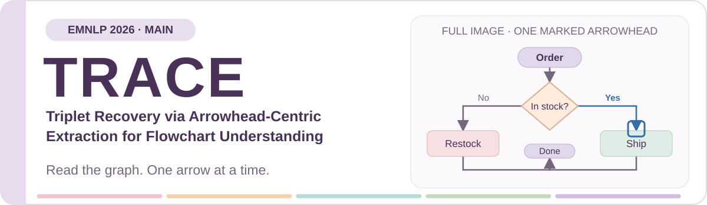
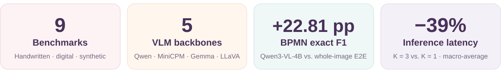
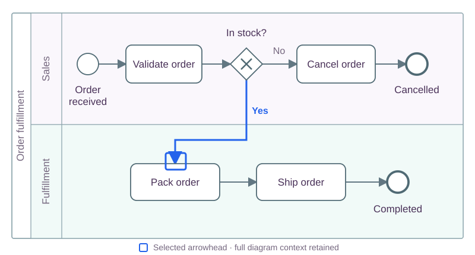

<div align="center">



### Read the graph. One arrow at a time.

<p>
<b>Daozhu&nbsp;Dong</b><sup>1</sup> · Kaiwen&nbsp;Shi<sup>1</sup> · Dan&nbsp;Si<sup>2</sup> · Xiaoyu&nbsp;Hao<sup>2</sup> · Tong&nbsp;Liu<sup>2</sup> · Wenjie&nbsp;Zhang<sup>2</sup> · Gong&nbsp;Cheng<sup>1</sup>
</p>
<p>
<sup>1</sup> State Key Laboratory of Novel Software Technology, Nanjing University<br>
<sup>2</sup> Lenovo (Beijing) Co., Ltd.
</p>

[](docs/files/trace-paper.pdf) [](https://nju-websoft.github.io/TRACE/?lang=en) [](LICENSE)

**[📄 Paper](docs/files/trace-paper.pdf) · [🖼️ Poster](docs/files/trace-poster.pdf) · [🌐 Project page](https://nju-websoft.github.io/TRACE/?lang=en) · [💾 Adapter](docs/CHECKPOINTS.md) · [🚀 Quickstart](docs/QUICKSTART.md) · [📜 Citation](#citation)**

</div>

**TRACE** recovers flowchart connections by detecting arrowheads, highlighting **one arrowhead in the full image**, and asking a fine-tuned vision-language model (VLM) to read that connection. The resulting triplets form a directed graph for downstream reasoning and question answering.

<p align="center">

</p>

<p align="center">
<a href="#motivation">Motivation</a> · <a href="#method">Method</a> · <a href="#experiments">Experiments</a> · <a href="#analysis">Analysis</a> · <a href="#getting-started">Getting started</a> · <a href="#resources">Resources</a>
</p>

---

<a id="motivation"></a>

## 🧩 01 / Motivation

### Why are flowchart connections hard to recover?

Thin connectors, tiny arrowheads, and dense layouts make flowcharts difficult to read as graphs. Two common approaches face different failure modes:

- **Detect nodes, then reconstruct edges:** missed or imprecise visual elements can propagate into incorrect connections.
- **Extract the whole graph in one VLM response:** small arrowheads and crowded paths can lead to missing edges or reversed directions.

**TRACE's key idea: focus the task, not crop the context.** Each query targets one marked arrowhead while retaining the entire flowchart. This gives every extracted connection a visual anchor that can be inspected and corrected locally.

---

<a id="method"></a>

## 🏹 02 / Method

<p align="center">

</p>

| Stage | What TRACE does |
|:--|:--|
| **① Synthesize & train** | Derive aligned arrowhead and triplet supervision from structured flowchart sources; train the arrowhead detector and fine-tune the VLM. |
| **② Locate & highlight** | Detect arrowheads and create one full-image view per arrowhead, highlighting only the selected head. |
| **③ Read & aggregate** | Recover `(source, condition, target)` for each view and assemble a directed graph; add `partOf` relations for hierarchical diagrams. |

### A BPMN connection, made explicit

<p align="center">

</p>

In this illustrative order-fulfillment process, the blue box marks the arrowhead entering **Pack order**. Its sequence flow crosses from the **Sales** lane to the **Fulfillment** lane and becomes:

```text
(In stock?, Yes, Pack order)
(In stock?, partOf, Sales)
(Pack order, partOf, Fulfillment)
```

**[Explore the interactive BPMN example →](https://nju-websoft.github.io/TRACE/?lang=en#method)** Select an arrow to inspect its triplet and lane membership. The example is hand-authored with predefined outputs, not live inference or a benchmark result. [Download its BPMN XML](docs/assets/bpmn-order-fulfillment.bpmn).

---

<a id="experiments"></a>

## 📊 03 / Experiments

We evaluate **9 benchmarks** spanning handwritten, digital, business-process, and synthetic flowcharts, with **5 VLM backbones**: Qwen3-VL-4B/8B, MiniCPM-V-4.5-8B, Gemma3-4B-IT, and LLaVA-v1.6-Mistral-7B.

### Triplet recovery

Representative results with **Qwen3-VL-4B**, task-specific fine-tuning, and **exact F1 (%)** (paper Table 2):

| Benchmark | Whole-image E2E | TRACE | Δ F1 (pp) |
|:--|--:|--:|--:|
| FC_B | 80.42 | **84.32** | +3.90 |
| FlowLearn | 88.50 | **93.61** | +5.11 |
| **BPMN-VLM** | 64.26 | **87.07** | **+22.81** |
| FlowGen-medium | 77.23 | **85.42** | +8.19 |
| FlowGen-hard | 68.91 | **74.82** | +5.91 |

<details>
<summary><b>All nine benchmarks · Qwen3-VL-4B</b></summary>

| Benchmark | Whole-image E2E | TRACE | Δ F1 (pp) |
|:--|--:|--:|--:|
| FlowVQA | 92.28 | **93.77** | +1.49 |
| CBD | **83.40** | 82.56 | −0.84 |
| FC_A | **64.60** | 63.91 | −0.69 |
| FC_B | 80.42 | **84.32** | +3.90 |
| FlowLearn | 88.50 | **93.61** | +5.11 |
| BPMN-VLM | 64.26 | **87.07** | +22.81 |
| FlowGen-easy | **85.87** | 84.18 | −1.69 |
| FlowGen-medium | 77.23 | **85.42** | +8.19 |
| FlowGen-hard | 68.91 | **74.82** | +5.91 |

</details>

[Compare all five backbones on the project page](https://nju-websoft.github.io/TRACE/?lang=en#results) · [Download the full results table](docs/assets/results.csv)

### Graph-based question answering

The recovered graph is also useful beyond extraction: a tool-calling QA layer queries the graph to answer flowchart questions.

| Method | FlowLearn accuracy (%) | FlowVQA accuracy (%) |
|:--|--:|--:|
| Zero-shot Qwen3-VL-4B | 66.83 | 62.03 |
| TextFlow with ground-truth text | 88.33 | 75.18 |
| **TRACE + graph tools** | **98.17** | **75.78** |
| Ground-truth triplets + graph tools | 100.00 | 78.46 |

Paper Table 4, evaluated on TextFlow's released subset: **100 FlowLearn images** and **197 FlowVQA images**. These are not full-dataset QA scores. All results shown here are reported paper results, not new GPU reruns of this release.

---

<a id="analysis"></a>

## 🔎 04 / Analysis

### Q1 · Can TRACE recover connections in an unseen domain?

In leave-one-out (LOO) evaluation, Qwen3-VL-4B trains on eight benchmarks and is tested on the held-out ninth. Without OCR post-processing, TRACE improves exact F1 on **8 of 9** held-out benchmarks:

| Held-out benchmark | Whole-image E2E LOO | TRACE LOO | Δ F1 (pp) |
|:--|--:|--:|--:|
| FlowVQA | 87.20 | **89.31** | +2.11 |
| CBD | **83.66** | 83.31 | −0.35 |
| FC_A | 45.46 | **61.38** | +15.92 |
| FC_B | 57.26 | **67.76** | +10.50 |
| FlowLearn | 53.77 | **65.93** | +12.16 |
| BPMN-VLM | 31.86 | **39.18** | +7.32 |
| FlowGen-easy | 95.87 | **96.97** | +1.10 |
| FlowGen-medium | 65.21 | **79.55** | +14.34 |
| FlowGen-hard | 57.93 | **69.42** | +11.49 |

Exact F1 (%), paper Appendix B, Table 6. Both methods use the same held-out benchmark protocol; the FlowLearn scores above exclude the optional OCR refinement.

### Q2 · Can we read several arrowheads per call?

Multi-arrowhead batching marks **K arrowheads** in a full-image view, trading a small amount of extraction accuracy for fewer VLM calls.

| Setting | Exact F1 (%) | Relaxed F1 (%) | Latency (s/image) |
|:--|--:|--:|--:|
| K = 1 | **83.30** | **86.52** | 4.00 |
| K = 2 | 82.92 | 86.08 | 2.78 |
| K = 3 | 82.81 | 85.84 | **2.44** |

**K = 3 reduces latency by 39% with a 0.49-point exact-F1 decrease.** These are macro-averages across nine benchmarks using Qwen3-VL-4B on an RTX 5880 Ada (paper Table 10); latency excludes model loading.

[Explore generalization and batching →](https://nju-websoft.github.io/TRACE/?lang=en#analysis)

---

<a id="getting-started"></a>

## 🚀 Getting started

### 1. Install

```bash
git clone https://github.com/nju-websoft/TRACE.git
cd TRACE
conda create -n trace python=3.12 -y
conda activate trace
pip install -r requirements.txt
# For detector / VLM training:
pip install -r requirements-training.txt
```

Reference environment: **Python 3.12 · PyTorch 2.8.0 / CUDA 12.8 · Transformers 4.57.1 · PEFT 0.15.2**. Select a PyTorch build compatible with your hardware.

### 2. Prepare data and models

Use the [data record](https://doi.org/10.5281/zenodo.20374997) and the benchmarks' original sources, then configure local paths following the [quickstart](docs/QUICKSTART.md#install-and-configure). The [model details and loading instructions](docs/CHECKPOINTS.md) describe the FC_A-held-out adapter. Obtain the Qwen base model and original SAM 3 from their publishers separately. Other adapters and fine-tuned detectors are not published; train them with the included launchers.

### 3. Follow your workflow

| I want to… | Start here |
|:--|:--|
| Prepare arrowhead-centered supervision | [Data preparation](docs/QUICKSTART.md#data-preparation) · [`gen_data/`](gen_data/) |
| Train detectors and VLM adapters | [Training commands](docs/QUICKSTART.md#train) · [`scripts/`](scripts/) · [`MLLMs_SFT/`](MLLMs_SFT/) |
| Recover triplets, batch arrowheads, and evaluate | [Inference & evaluation](docs/QUICKSTART.md#infer-and-evaluate) · [`lora/`](lora/) |
| Reproduce dataset-specific experiments | [Full reproduction guide](docs/REPRODUCING.md) |
| Explore graph-based question answering | [`QA/`](QA/) · [Input requirements](docs/QUICKSTART.md#infer-and-evaluate) |
| Preview or maintain the bilingual website | [Website guide](docs/WEBSITE.md) |

Evaluation supports exact F1 and relaxed F1 (component edit similarity ≥ 0.85). Define the test split explicitly with `--image-dir` or `--test-json`; missing predictions must count toward the score. See the [release notes](docs/QUICKSTART.md#infer-and-evaluate) for evaluation corrections and sampled-test requirements.

<details>
<summary><b>Repository map</b></summary>

```text
TRACE/
├── gen_data/        Source parsing, supervision formatting, K-arrow synthesis
├── detection/       Arrowhead COCO generation and YOLO conversion
├── sam3/            SAM 3 implementation and training configurations
├── MLLMs_SFT/       Qwen, Gemma, LLaVA, MiniCPM fine-tuning launchers
├── lora/
│   ├── inference/   TRACE, whole-image E2E, batching, and API inference
│   └── eval/        Dataset-specific exact / relaxed F1
├── postprocess/     Optional OCR vocabulary correction
├── QA/              Graph-query tools and downstream QA
├── assets/          SAM 3 tokenizer vocabulary
├── scripts/         Detector training and local path configuration
├── tests/           Evaluation and data-path regression checks
└── docs/            Website, guides, paper, poster, and result tables
```

Datasets, weights, model outputs, logs, and local settings are excluded from git. This is the TRACE paper's arrowhead-centric pipeline; the older geometric node-segmentation pipeline is not part of this release.

</details>

---

<a id="resources"></a>

## 📚 05 / Resources

**Model checkpoint:** [Qwen3-VL-4B FC_A-held-out LOO adapter on Hugging Face](https://huggingface.co/SuperbPiggy/trace-qwen3-vl-4b-loo-fca) · [Model details and loading instructions](docs/CHECKPOINTS.md). Adapter only; no Qwen base weights or SAM 3 checkpoint.

| Paper | Poster | Project page | Data record |
|:--|:--|:--|:--|
| [Read PDF](docs/files/trace-paper.pdf) | [View poster](docs/files/trace-poster.pdf) | [English](https://nju-websoft.github.io/TRACE/?lang=en) / [Chinese](https://nju-websoft.github.io/TRACE/) | [Zenodo record](https://doi.org/10.5281/zenodo.20374997) |
| Method, comparisons, and ablations | Visual research overview | Interactive BPMN example and results | Synthesized supervision and arrowhead annotations |

Consult the data record for current file availability and access instructions. Benchmark-derived data retain their upstream terms; this code release does not change data permissions.

<a id="citation"></a>

## 📜 Citation

If TRACE is useful in your research, please cite our **EMNLP 2026 Main** paper:

```bibtex
@inproceedings{dong2026trace,
  title = {TRACE: Triplet Recovery via Arrowhead-Centric Extraction for Flowchart Understanding},
  author = {Dong, Daozhu and Shi, Kaiwen and Si, Dan and Hao, Xiaoyu and Liu, Tong and Zhang, Wenjie and Cheng, Gong},
  booktitle = {Proceedings of the 2026 Conference on Empirical Methods in Natural Language Processing},
  year = {2026},
  note = {Accepted to the Main Conference; proceedings metadata forthcoming},
  url = {https://github.com/nju-websoft/TRACE}
}
```

This citation is provisional; pages, DOI, and the ACL Anthology link will be added when the proceedings are available. **Correspondence:** [Gong Cheng](mailto:gcheng@nju.edu.cn).

### License & acknowledgments

TRACE-authored code is licensed under [Apache-2.0](LICENSE). Third-party code, models, datasets, institutional logos, and poster illustrations retain their respective terms; see [third-party notices](THIRD_PARTY_NOTICES.md) and [poster artwork notices](docs/assets/poster/README.md).

The README shares the project website and poster's purple-and-pastel visual identity. Its banner and result cards are editable, self-contained SVG assets in [`docs/assets/readme/`](docs/assets/readme/).
